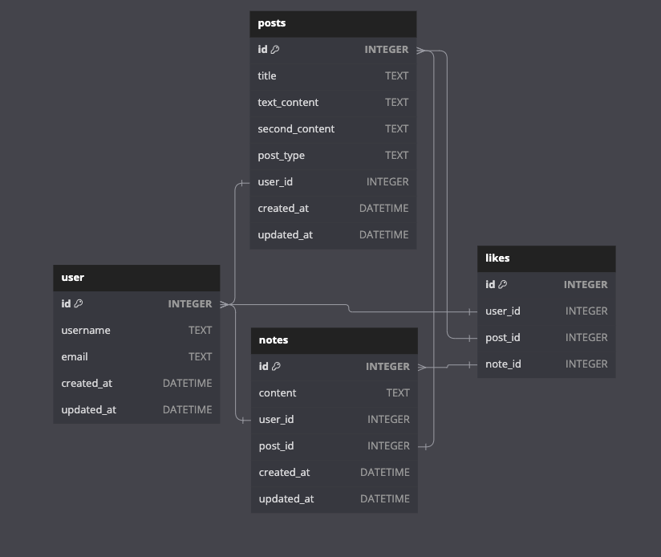

# Fumblr(Tumblr Clone)

A clone of Tumblr's website

# Index 

- [About](#about)
- [Features List](#features)
- [Landing Page](#landing-page)
- [Screenshots of Application](#screenshots)
- [Tech Stacks](#tech-stacks)
- [Database Schema](#database-schema)
<!-- - [API Routes Document](#api-routes-document) -->
<!-- - [React Components List](#react-components-list) -->
<!-- - [Frontend Routes Document](#frontend-routes-document) -->

## About

This project is a clone of the Tumblr website, aiming to replicate its core functionality. It provides users with a platform to express themselves through various content types, such as text, images, audio, and video.

## Features

- **User Authentication**: Users can sign up and log in.
- **Create Posts**: Users can create various types of posts, including text, images, quotes, and links.
- **Dashboard**: Users can view and interact with posts from other users.
- **Likes**: Users can like and unlike posts.
- **Comments**: Users can leave comments on posts.
- **Discover Content**: Users can explore and discover new content from other users.

## Landing Page

To get started, you can visit our [Fumblr](https://fumblr-project.onrender.com/). 
 Here,  you will find access to the Login and Signup pages. 
We've also provided a demo user button for you to explore the website without the need to sign up.

<!-- ## Screenshots  -->

## Tech Stack

- React
- Redux
- HTML/CSS
- JavaScript
- Python
- Flask
- AWS S3 Buckets
- Docker
- SQL

## Database Schema

